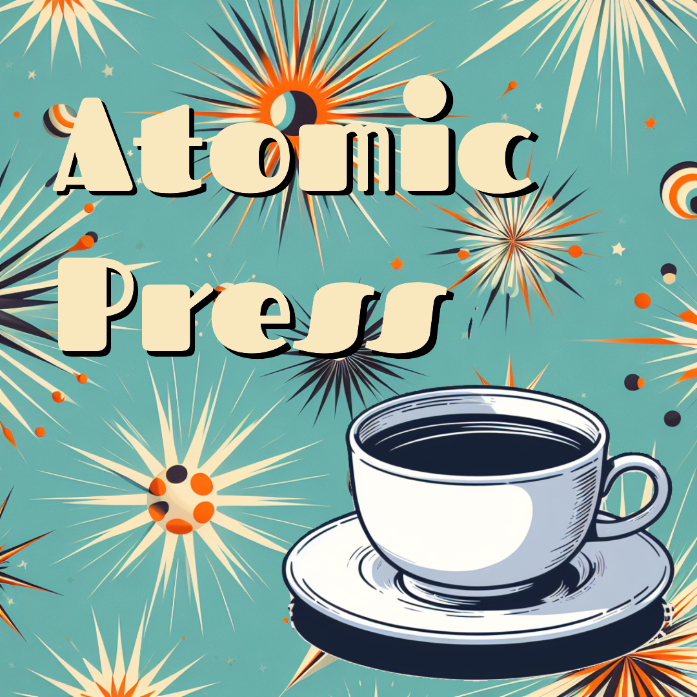
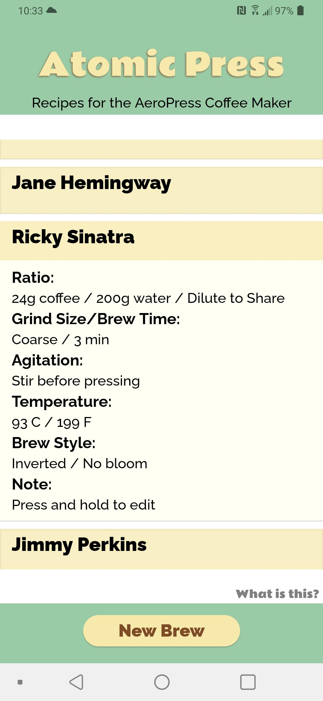
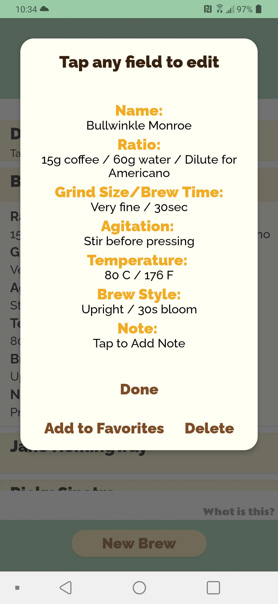
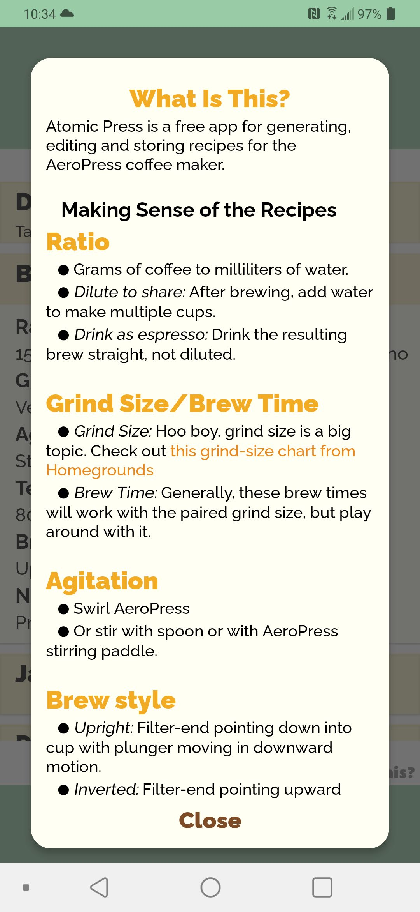

# Atomic Press

### Recipes for the AeroPress Coffee Maker

  

Atomic Press is a free mobile app for generating, editing, and storing recipes for the [AeroPress](https://www.aeropress.com) coffee maker. Press a button and the app rolls up a completely randomized brew — with a retro-1950s name to match.

## Features

- **One-tap recipe generator** — Hit **New Brew** and Atomic Press rolls a random recipe, including a groovy 1950s-style name pulled from a built-in list of era-appropriate first and last names.
- **Five randomized variables** — Every recipe comes with a coffee-to-water **ratio**, a paired **grind size & brew time**, an **agitation** method (swirl, stir, shake, and more), a **temperature**, and a **brew style** (upright, inverted, and so on).
- **Reroll to taste** — Don't like a roll? Hit **Try Again** and reroll from scratch. Results can occasionally get absolutely bonkers, and that's half the fun.
- **Recipe library** — Save your favorites and browse your whole collection on the home screen.
- **Edit anything** — Long-press any saved recipe to open the editor, then tap any field to tweak the name, ratio, grind, agitation, temperature, brew style, or your own notes.
- **Notes & favorites** — Jot down tasting notes on each brew and star the recipes worth repeating.
- **Delete with confidence** — Remove recipes from your library with a handy *Delete-O-Matic* confirmation.
- **Learn the basics** — The built-in **What is this?** guide explains every variable and links out to a grind-size chart, so you can brew with confidence.
- **100% offline** — All recipes are stored locally on your device.

## Screenshots

| | |
|---|---|
|  |  |
|  |  |

## The Retro Vibe

Atomic Press is built around a classic atomic-age aesthetic straight out of the 1950s — cream, mint, and burnt-amber colorways, coffee-brown accents, and chunky rounded display type (**Rammetto One**) paired with the clean **Raleway** body font. It looks like it could have rolled off the assembly line in 1958.

## Tech Stack

- [React Native](https://reactnative.dev) + [Expo](https://expo.dev)
- Local persistence with [AsyncStorage](https://github.com/react-native-async-storage/async-storage)
- Custom fonts loaded via [expo-font](https://docs.expo.dev/versions/latest/sdk/font/)

## Built On

Atomic Press is based on the original *AeroPress Recipe Dice* concept by [James Hoffmann](http://jameshoffmann.co.uk). Not in any way officially associated with AeroPress.

---

© 2024 [Robot Lions](https://robotlions.com)
